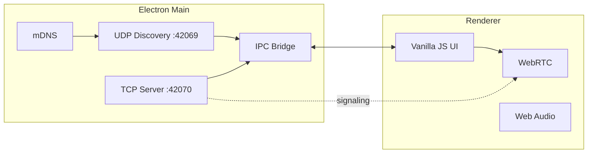

<div align="center">

# BLIP

**P2P messenger for local networks — no cloud, no servers, no internet.**

[](https://www.electronjs.org/)
[](https://vitejs.dev/)
[](LICENSE)
[]()
[]()
[]()

*You're on the grid. You're the signal.*

</div>

## Navigation

| Section | English | Русский |
|---------|---------|---------|
| Language | [**English**](#english) | [**Русский**](#russian) |
| Testing (one PC) | [Testing](#en-testing) | [Тестирование](#ru-testing) |
| Overview | [Overview](#en-overview) | [Обзор](#ru-overview) |
| Features | [Features](#en-features) | [Возможности](#ru-features) |
| Architecture | [Architecture](#en-architecture) | [Архитектура](#ru-architecture) |
| Stack | [Stack](#en-stack) | [Стек](#ru-stack) |
| Quick start | [Quick start](#en-quick-start) | [Быстрый старт](#ru-quick-start) |
| npm scripts | [npm scripts](#en-scripts) | [Скрипты npm](#ru-scripts) |
| Ports | [Ports](#en-ports) | [Порты](#ru-ports) |
| Usage | [Usage](#en-usage) | [Использование](#ru-usage) |
| Fonts | [Fonts](#en-fonts) | [Шрифты](#ru-fonts) |
| Project layout | [Project layout](#en-layout) | [Структура](#ru-layout) |
| Design tokens | [Design](#en-design) | [Дизайн](#ru-design) |
| License | [License](#en-license) | [Лицензия](#ru-license) |
| Community | [Community](#en-community) | [Сообщество](#ru-community) |
| Landing | [krwg.github.io/BLIP](https://krwg.github.io/BLIP/) | [Сайт Pages](https://krwg.github.io/BLIP/) |

---

<h2 id="english">English</h2>

<h3 id="en-testing">Testing on one PC</h3>

| Approach | Works for chat/calls? |
|----------|---------------------|
| **Two BLIP windows on the same PC** | **No** — both try to bind UDP `42069` and TCP `42070`; the second copy usually fails or cannot discover the first. |
| **VM** (VirtualBox / Hyper-V) with bridged network | **Yes** — guest gets its own IP; install or run BLIP in the VM. |
| **Second device** on the same Wi‑Fi (laptop, old PC) | **Yes** — recommended. |
| **Hamachi / Radmin VPN** between two machines | **Yes** — same as LAN. |
| **Phone** | No mobile app yet — desktop only. |

Quick VM flow: host runs BLIP (ID **1**), VM runs BLIP (ID **2**), same subnet via bridged adapter, allow firewall for ports **42069–42070**.

<h3 id="en-overview">Overview</h3>

| | |
|---|---|
| **What** | Desktop app: text, voice, and video over LAN / Hamachi / Radmin VPN |
| **Identity** | BLIP ID **1–64** (8×8 grid, Minecraft-style chunk metaphor) |
| **Servers** | None — UDP broadcast, TCP, and WebRTC peer-to-peer only |
| **Sign-up** | None |
| **UI** | Pixel-art × liquid glass × brutalism, **0px border-radius** |

<h3 id="en-features">Features</h3>

| Feature | Description |
|---------|-------------|
| **BLIP ID** | Pick a number on the 8×8 grid; conflicts resolved via TCP ping |
| **Discovery** | UDP `42069` + mDNS fallback |
| **Chat** | TCP `42070`, JSON messages |
| **Calls** | WebRTC without STUN/TURN (LAN only) |
| **Avatars** | 8×8 canvas, colors from ID hash |
| **Sound** | Web Audio API synthesis (no audio files) |
| **Languages** | English / Russian (`localStorage`) |
| **Window** | Custom title bar, system tray |

<h3 id="en-architecture">Architecture</h3>



```
┌─────────────────────────────────────────────────────────┐
│  BLIP ID Grid 8×8          Peers          Chat / Call   │
│  ┌─┬─┬─┬─┬─┬─┬─┬─┐         #17 Online      ┌──────────┐ │
│  │1│2│3│…│ │ │ │64│  ──►   #42 Offline ──► │ messages │ │
│  └─┴─┴─┴─┴─┴─┴─┴─┘                         └──────────┘ │
└─────────────────────────────────────────────────────────┘
```

<h3 id="en-stack">Stack</h3>

| Layer | Technology |
|-------|------------|
| Shell | Electron 35 |
| Bundler | Vite 6 |
| UI | Vanilla JS + CSS |
| Discovery | `dgram` + `multicast-dns` |
| Media | WebRTC (`RTCPeerConnection`) |
| Fonts | **Minecraft** (bundled woff2) |

<h3 id="en-quick-start">Quick start</h3>

**Requirements**

| | |
|---|---|
| Node.js | **20+** (see `.nvmrc`) |
| OS | Windows 10/11 (for `.exe` builds) |
| Network | Same LAN / VPN (Hamachi, Radmin) |

**Install**

```bash
git clone <repo-url>
cd blip
npm install
```

`postinstall` copies the Minecraft font into `renderer/assets/fonts/`.

**Development (hot-reload)**

```bash
npm run electron:dev
```

Vite at `http://localhost:5173` + Electron.

**Run locally**

```bash
npm run build
npx electron .
```

Or `npm start` (runs `prebuild` automatically).

**Windows builds**

Icons: root `icon.svg` → `npm run build:icons` → `build/icon.ico`.

| Command | Output |
|---------|--------|
| `npm run electron:build` | **`BLIP-Setup-0.1.4.exe`** — full NSIS installer |
| `npm run electron:build:portable` | **`BLIP-0.1.4-Portable.exe`** — single-file portable |
| `npm run electron:build:all` | Both artifacts |
| `npm run electron:build:dir` | `dist-electron/win-unpacked/BLIP.exe` (debug folder) |

- **Installer (NSIS):** choose install folder, Start Menu shortcut, optional desktop shortcut, icon from `icon.svg`.
- **Portable:** one `.exe`, copy anywhere; settings live in `%APPDATA%`.

<h3 id="en-scripts">npm scripts</h3>

| Script | Purpose |
|--------|---------|
| `npm run dev` | Vite dev server only |
| `npm run build` | Build renderer → `dist/` |
| `npm start` | `prebuild` + Electron |
| `npm run electron:dev` | Vite + Electron |
| `npm run build:icons` | `icon.svg` → `build/icon.ico` + PNG |
| `npm run electron:build` | NSIS installer |
| `npm run electron:build:portable` | Portable `.exe` |
| `npm run electron:build:all` | Installer + portable |
| `npm run electron:build:dir` | Unpacked app folder |
| `npm run copy-fonts` | Copy Minecraft font from npm package |

<h3 id="en-ports">Ports & protocols</h3>

| Port | Protocol | Purpose |
|:----:|:--------:|---------|
| **42069** | UDP | Announce: `blipId`, `displayName`, `ip` |
| **42070** | TCP | Messages + WebRTC signaling |

<details>
<summary><strong>UDP announce example</strong></summary>

```json
{
  "type": "announce",
  "blipId": 17,
  "displayName": "Cyber",
  "ip": "192.168.1.42"
}
```

</details>

<h3 id="en-usage">Usage</h3>

1. Launch **BLIP** on each machine on the same network.
2. Pick a free number on the **8×8** grid.
3. Set your display name in **SETTINGS** · switch **EN / RU**.
4. Dial a BLIP ID or open **PEERS** → message or call.

> Open firewall ports **42069–42070** only if peers are not discovered.

<h3 id="en-fonts">Fonts</h3>

| Font | Used for | Files |
|------|----------|-------|
| **Minecraft** | UI, buttons, headings | `renderer/assets/fonts/minecraft.woff2` |
| **Minecraft** | Chat (as typed) | same face |
| Fallback | monospace / DOS VGA | if woff2 is missing |

Source: [`typeface-minecraft`](https://github.com/bs-community/typeface-minecraft) (MIT).  
Re-copy manually: `npm run copy-fonts`.

<h3 id="en-layout">Project layout</h3>

```
blip/
├── main/              # Electron: discovery, TCP, tray
├── renderer/          # UI, chat, call, i18n, styles
│   └── assets/fonts/  # Minecraft woff2/ttf
├── build/             # icon.ico, icon.png (generated)
├── preload.cjs        # IPC bridge
├── scripts/           # electron-dev, copy-fonts, build-icons
├── icon.svg           # source app icon
└── dist/              # Vite output (after npm run build)
```

<h3 id="en-design">Design tokens</h3>

| Token | Value |
|-------|-------|
| Background | `#0a0a0a` |
| Glass | `rgba(20,20,20,0.7)` + `blur(12px)` |
| Accent | `#00ffc8` |
| Danger | `#ff3366` |
| Muted | `#333333` |
| Borders | `2px solid` |
| Radius | **0** everywhere |

<h3 id="en-community">Community</h3>

| Doc | Purpose |
|-----|---------|
| [CONTRIBUTING.md](CONTRIBUTING.md) | Setup, dev workflow, PR expectations |
| [CODE_OF_CONDUCT.md](CODE_OF_CONDUCT.md) | Community standards |
| [SECURITY.md](SECURITY.md) | Reporting vulnerabilities |
| [CHANGELOG.md](CHANGELOG.md) | Release history |
| [docs/ARCHITECTURE.md](docs/ARCHITECTURE.md) | Technical map |
| [Landing site (Pages)](https://krwg.github.io/BLIP/) | Static showcase (`docs/index.html`) |

<h3 id="en-license">License</h3>

This project is licensed under **[GNU GPL v3](LICENSE)**.

The **Minecraft** font is licensed separately under [MIT](https://github.com/bs-community/typeface-minecraft) (see `renderer/assets/fonts/README.md`).

---

<h2 id="russian">Русский</h2>

*Ты в сети. Ты сигнал.*

<h3 id="ru-testing">Тестирование на одном ПК</h3>

| Способ | Чат / звонки? |
|--------|----------------|
| **Два окна BLIP на одном ПК** | **Нет** — порты `42069` (UDP) и `42070` (TCP) заняты; второй экземпляр не поднимется или не увидит первого. |
| **Виртуальная машина** (VirtualBox / Hyper-V, сеть bridged) | **Да** — у гостя свой IP; BLIP в VM + на хосте. |
| **Второе устройство** в той же Wi‑Fi | **Да** — лучший вариант. |
| **Hamachi / Radmin VPN** на двух машинах | **Да** — как LAN. |
| **Телефон** | Мобильного клиента пока нет. |

Кратко: хост BLIP ID **1**, в VM BLIP ID **2**, одна подсеть, firewall открыт для **42069–42070**.

<h3 id="ru-overview">Обзор</h3>

| | |
|---|---|
| **Что это** | Desktop-приложение: текст, голос и видео по LAN / Hamachi / Radmin VPN |
| **Идентификация** | BLIP ID **1–64** (сетка 8×8) |
| **Серверы** | Нет — только UDP broadcast, TCP и WebRTC между пирами |
| **Регистрация** | Нет |
| **Стиль UI** | Pixel-art × liquid glass × brutalism, **0px border-radius** |

<h3 id="ru-features">Возможности</h3>

| Функция | Описание |
|---------|----------|
| **BLIP ID** | Выбор номера на сетке 8×8, конфликты через TCP ping |
| **Discovery** | UDP `42069` + mDNS fallback |
| **Чат** | TCP `42070`, JSON-сообщения |
| **Звонки** | WebRTC без STUN/TURN (только LAN) |
| **Аватары** | 8×8 canvas, цвет от hash ID |
| **Звук** | Web Audio API — синтез, без файлов |
| **Языки** | English / Русский (`localStorage`) |
| **Окно** | Кастомный title bar, system tray |

<h3 id="ru-architecture">Архитектура</h3>

См. [диаграмму выше](#en-architecture) — та же схема для обоих языков.

<h3 id="ru-stack">Стек</h3>

| Слой | Технология |
|------|------------|
| Shell | Electron 35 |
| Bundler | Vite 6 |
| UI | Vanilla JS + CSS |
| Discovery | `dgram` + `multicast-dns` |
| Media | WebRTC (`RTCPeerConnection`) |
| Fonts | **Minecraft** (bundled woff2) |

<h3 id="ru-quick-start">Быстрый старт</h3>

**Требования**

| | |
|---|---|
| Node.js | **20+** (see `.nvmrc`) |
| ОС | Windows 10/11 (сборка `.exe`) |
| Сеть | Одна LAN / VPN (Hamachi, Radmin) |

**Установка**

```bash
git clone <repo-url>
cd blip
npm install
```

`postinstall` копирует шрифт Minecraft в `renderer/assets/fonts/`.

**Разработка (hot-reload)**

```bash
npm run electron:dev
```

Vite → `http://localhost:5173` + Electron.

**Локальный запуск**

```bash
npm run build
npx electron .
```

или `npm start` (сборка через `prebuild`).

**Сборка Windows**

Иконка: корневой `icon.svg` → `npm run build:icons` → `build/icon.ico`.

| Команда | Результат |
|---------|-----------|
| `npm run electron:build` | **`BLIP-Setup-0.1.4.exe`** — установщик NSIS |
| `npm run electron:build:portable` | **`BLIP-0.1.4-Portable.exe`** — portable |
| `npm run electron:build:all` | Оба файла |
| `npm run electron:build:dir` | `dist-electron/win-unpacked/BLIP.exe` |

- **Установщик:** выбор папки, ярлык в «Пуск», опция ярлыка на рабочем столе.
- **Portable:** один `.exe`, настройки в `%APPDATA%`.

<h3 id="ru-scripts">Скрипты npm</h3>

| Скрипт | Назначение |
|--------|------------|
| `npm run dev` | Только Vite dev-server |
| `npm run build` | Сборка renderer → `dist/` |
| `npm start` | `prebuild` + Electron |
| `npm run electron:dev` | Vite + Electron |
| `npm run build:icons` | `icon.svg` → `build/icon.ico` + PNG |
| `npm run electron:build` | NSIS-установщик |
| `npm run electron:build:portable` | Portable `.exe` |
| `npm run electron:build:all` | Установщик + portable |
| `npm run electron:build:dir` | Распакованная папка |
| `npm run copy-fonts` | Скопировать Minecraft из npm-пакета |

<h3 id="ru-ports">Порты и протоколы</h3>

| Порт | Протокол | Назначение |
|:----:|:--------:|------------|
| **42069** | UDP | Announce: `blipId`, `displayName`, `ip` |
| **42070** | TCP | Сообщения + WebRTC signaling |

<details>
<summary><strong>Пример UDP announce</strong></summary>

```json
{
  "type": "announce",
  "blipId": 17,
  "displayName": "Cyber",
  "ip": "192.168.1.42"
}
```

</details>

<h3 id="ru-usage">Использование</h3>

1. Запустите **BLIP** на каждом ПК в одной сети.
2. Выберите свободный номер на сетке **8×8**.
3. Задайте имя в **НАСТРОЙКИ** · переключите **EN / RU**.
4. Наберите BLIP ID или откройте **АБОНЕНТЫ** → сообщение / звонок.

> Откройте порты **42069–42070** в firewall, только если пиры не видны.

<h3 id="ru-fonts">Шрифты</h3>

| Шрифт | Где | Файлы |
|-------|-----|-------|
| **Minecraft** | Весь UI | `renderer/assets/fonts/minecraft.woff2` |
| **Minecraft** | Чат | тот же face |
| Fallback | monospace | если woff2 недоступен |

Источник: [`typeface-minecraft`](https://github.com/bs-community/typeface-minecraft) (MIT).  
Перекопировать: `npm run copy-fonts`.

<h3 id="ru-layout">Структура проекта</h3>

```
blip/
├── main/              # Electron: discovery, TCP, tray
├── renderer/          # UI, chat, call, i18n, styles
│   └── assets/fonts/  # Minecraft woff2/ttf
├── build/             # icon.ico, icon.png (генерируется)
├── preload.cjs        # IPC bridge
├── scripts/           # electron-dev, copy-fonts, build-icons
├── icon.svg           # исходная иконка
└── dist/              # Vite build
```

<h3 id="ru-design">Дизайн-система</h3>

| Токен | Значение |
|-------|----------|
| Background | `#0a0a0a` |
| Glass | `rgba(20,20,20,0.7)` + `blur(12px)` |
| Accent | `#00ffc8` |
| Danger | `#ff3366` |
| Muted | `#333333` |
| Borders | `2px solid` |
| Radius | **0** (везде) |

<h3 id="ru-community">Сообщество</h3>

| Документ | Зачем |
|----------|--------|
| [CONTRIBUTING.md](CONTRIBUTING.md) | Сборка, dev, правила PR |
| [CODE_OF_CONDUCT.md](CODE_OF_CONDUCT.md) | Правила сообщества |
| [SECURITY.md](SECURITY.md) | Как сообщить об уязвимости |
| [CHANGELOG.md](CHANGELOG.md) | История версий |
| [docs/ARCHITECTURE.md](docs/ARCHITECTURE.md) | Архитектура кода |
| [Landing (Pages)](https://krwg.github.io/BLIP/) | Статический сайт-витрина (`docs/index.html`) |

<h3 id="ru-license">Лицензия</h3>

Проект распространяется под **[GNU GPL v3](LICENSE)**.

Шрифт **Minecraft** — отдельно, [MIT](https://github.com/bs-community/typeface-minecraft) (см. `renderer/assets/fonts/README.md`).

---

<div align="center">

**BLIP** · local-only · peer-to-peer · 1–64

[English](#english) · [Русский](#russian)

</div>
