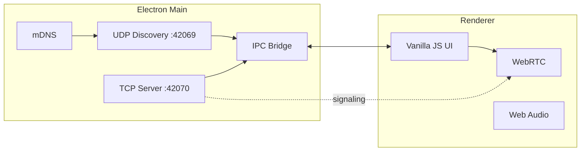

<div align="center">


# BLIP


<br>

[](https://github.com/krwg/blip/releases)
[](https://www.electronjs.org/)
[](LICENSE)
[]()
[]()

<!-- Dynamic stats row -->
[](https://github.com/krwg/blip/stargazers)
[](https://github.com/krwg/blip/releases)
[](https://github.com/krwg/blip/commits/main)
[](https://github.com/krwg/blip/issues)

<br>
 
*You're on the grid. You're the signal.*
[**English**](#english) · [**Русский**](#russian) · [**Сайт**](https://krwg.github.io/blip/)
 
</div> 

## Navigation

| Section | English | Русский |
|---------|---------|---------|
| Testing (one PC) | [Testing](#en-testing) | [Тестирование](#ru-testing) |
| Overview | [Overview](#en-overview) | [Обзор](#ru-overview) |
| Features | [Features](#en-features) | [Возможности](#ru-features) |
| MESH+ | [MESH+](#en-mesh-plus) | [MESH+](#ru-mesh-plus) |
| Signal Corps | [Signal Corps](#en-signal-corps) | [Сигнал Корпс](#ru-signal-corps) |
| Architecture | [Architecture](#en-architecture) | [Архитектура](#ru-architecture) |
| Stack | [Stack](#en-stack) | [Стек](#ru-stack) |
| Quick start | [Quick start](#en-quick-start) | [Быстрый старт](#ru-quick-start) |
| npm scripts | [npm scripts](#en-scripts) | [Скрипты npm](#ru-scripts) |
| Ports | [Ports](#en-ports) | [Порты](#ru-ports) |
| Usage | [Usage](#en-usage) | [Использование](#ru-usage) |
| Shortcuts | [Shortcuts](#en-shortcuts) | [Горячие клавиши](#ru-shortcuts) |
| Fonts | [Fonts](#en-fonts) | [Шрифты](#ru-fonts) |
| Project layout | [Project layout](#en-layout) | [Структура](#ru-layout) |
| Design tokens | [Design](#en-design) | [Дизайн](#ru-design) |
| License | [License](#en-license) | [Лицензия](#ru-license) |
| Community | [Community](#en-community) | [Сообщество](#ru-community) |
| Landing | [Pages](https://krwg.github.io/blip/) | [Сайт](https://krwg.github.io/blip/) |
| Troubleshooting | [Troubleshooting](#en-troubleshooting) | [Устранение неполадок](#ru-troubleshooting) |

---

<h2 id="english">English</h2>


<h3 id="en-testing">Testing on one PC</h3>

| Approach | Works for chat/calls? |
|----------|---------------------|
| **Two BLIP windows on the same PC** | **No** — both try to bind UDP `42069` and TCP `42070`; the second copy usually fails or cannot discover the first. |
| **VM** (VirtualBox / Hyper-V) with bridged network | **Yes** — guest gets its own IP; install or run BLIP in the VM. |
| **Second device** on the same Wi‑Fi (laptop, old PC) | **Yes** — recommended. |
| **Hamachi / Radmin VPN** between two machines | **Yes** — same as LAN. |
| **Phone** | No mobile app yet — desktop only. |

Quick VM flow: host runs BLIP (ID **1**), VM runs BLIP (ID **2**), same subnet via bridged adapter, allow firewall for ports **42069–42070**.

<h3 id="en-overview">Overview</h3>

| | |
|---|---|
| **What** | Desktop app: text, voice, and video over LAN / Hamachi / Radmin VPN |
| **Release** | **2.0.0 — Morse** (in development; see [`CHANGELOG.md`](CHANGELOG.md); last published: [1.1.1 Beacon](https://github.com/krwg/blip/releases/tag/1.1.1)) |
| **Identity** | BLIP ID **1–64** (8×8 grid, Minecraft-style chunk metaphor) |
| **Servers** | None — UDP broadcast, TCP, and WebRTC peer-to-peer only |
| **Sign-up** | None |
| **UI** | Pixel-art × liquid glass × brutalism, **0px border-radius** |

<h3 id="en-features">Features</h3>

| Feature | Description |
|---------|-------------|
| **BLIP ID** | Pick a number on the 8×8 grid; conflicts resolved via TCP ping |
| **Discovery** | UDP `42069` + mDNS fallback |
| **Chat** | TCP messages, receipts (✓/✓✓), reactions, LAN images, linkify, emoji picker, **Ctrl+F** search, export, typing, unread |
| **Groups** | Group chat (beta), custom name & avatar, **voice channels** in the community view (host star relay); LAN avatar sync; legacy **group call** window still available |
| **Favorites** | Star peers locally; sorted first on Peers and Chat |
| **Presence** | Online / Away / Busy in Profile (UDP announce) |
| **Calls** | Separate **1:1** and **group** call windows; WebRTC voice/video (LAN, no STUN/TURN) |
| **Screen share** | 720p+ capture, theater layout, fullscreen (**F**), stream/fullscreen quality in Settings |
| **Mesh Pulse** | Live LAN heartbeat — auto ping every minute, latency under each peer |
| **Trust & block** | First-chat confirm; local block list; **Settings → Privacy** |
| **Avatars** | 8×8 auto-generated from BLIP ID; regenerate in Settings |
| **Themes** | Light/dark palettes + animated backgrounds (EN/RU names) |
| **Sound** | Chiptune Web Audio — **SIGNAL** / **PULSE** FX packs, **MESH** / **GRID** call melodies; preview in **Settings → Sound**; DND mutes all |
| **Files** | P2P send in chat (1–100 GB limit in Settings, chunked); drag & drop; group inline ≤768 KB + chunked to all members |
| **BEACON** | LAN mesh file library (**МАЯК**): publish seeds, multi-peer download, pause/resume seeding, `blip://seed/…`, `.blip` descriptors, transfer hub |
| **Clipboard** | Optional LAN clipboard sync — **Settings → Network** (off / active chat / trusted peers) |
| **Status** | Custom status line on LAN (Profile) — “In game”, AFK, etc. |
| **Handshake** | Ed25519 signed announce + TCP mesh handshake (0.5+); VPN/Tailscale IP routes update discovery; block list enforced in main |
| **Shortcuts** | In-window + system-wide (**Alt+1–4**, tray-safe) |
| **Languages** | Full **English / Russian** UI (including group call chrome and badges) |
| **Settings** | Profile, privacy/block list, appearance, network, shortcuts, call devices, transfers |
| **Window** | Custom title bar, system tray, close-to-tray (Windows), **launch at login** (Windows) |
| **Updates** | Auto-check on startup (NSIS **Setup** builds; attach `latest.yml` on GitHub — see [`CONTRIBUTING.md`](CONTRIBUTING.md)) |
| **MESH+** | Optional test tier — extra customization, early features, profile badge; keys free from the author ([details](docs/MESH-PLUS.md)) |

<h3 id="en-mesh-plus">MESH+</h3>

**MESH+** is a **test subscription** the author uses to learn how to ship a **license-checked** desktop app (offline key, author verification). Keys are issued **personally**, **free of charge** — email **[blipteam@icloud.com](mailto:blipteam@icloud.com)**. Paste your `BLIP-XXXX-…` key in **Settings → MESH+**.

| | |
|---|---|
| **Today** | Subscribers get **new features first** while they are tested on the LAN |
| **Later** | Planned to move **today’s MESH+ features into FREE** for everyone |
| **Always** | Extra **customization** (themes, sounds, icons, status GIF, Signal Corps tools) and a **MESH+ badge** on your profile |

| Category | Examples |
|----------|----------|
| **Look & feel** | Animated backgrounds *Ember* / *Rift*, **Wire** / **Static** FX, **Beacon** / **Chime** melodies, custom `#RRGGBB` accent, six **mesh** app icons |
| **Profile** | **Status GIF** cloud visible to peers on the LAN |
| **Signal Corps** | **Board** (kanban), **Canvas** (32×16), Pad snapshots, Clipboard **500** entries + search |
| **Social** | **MESH+** badge on peers; themed chat export (PDF/HTML) |

FREE keeps chat, voice/video, groups (beta), Pad, Mesh Pulse, core themes, and Clipboard (20 entries). Full list: [`docs/MESH-PLUS.md`](docs/MESH-PLUS.md).

<h3 id="en-signal-corps">Signal Corps — the must-have mesh workspace</h3>

**Signal Corps** is BLIP’s flagship feature for anyone who builds on the LAN: a dedicated **PROJECTS** section (enable in **Settings → Developer**) that is **not tied to groups** — groups stay experimental; Signal Corps is the stable war room.

| Why it matters | What you get |
|----------------|--------------|
| **Pair programming without the cloud** | Shared **Pad** — one notepad synced over TCP to every **online peer** on your mesh (LWW, 300 ms debounce); **MESH+** pad snapshots with restore. |
| **Built for dev crews** | **✦ Pad** · **▦ Board** (kanban, RMB on cards) · **◻ Canvas** (32×16, brush/fill, palette) · **⧉ Clipboard** (enable in **Settings → Network**). Board/Canvas/500-clip search need **MESH+**. |
| **LAN-native** | Same philosophy as BLIP chat and calls — no servers, no accounts, no upload to someone else’s SaaS. |
| **Off until you opt in** | Hidden by default; flip **Projects** in Developer and **PROJECTS** appears in the nav. |

If you ship one BLIP feature to your squad this quarter, make it **Signal Corps**.

<h3 id="en-architecture">Architecture</h3>



```
┌─────────────────────────────────────────────────────────┐
│  BLIP ID Grid 8×8          Peers          Chat / Call   │
│  ┌─┬─┬─┬─┬─┬─┬─┬─┐         #17 Online      ┌──────────┐ │
│  │1│2│3│…│ │ │ │64│  ──►   #42 Offline ──► │ messages │ │
│  └─┴─┴─┴─┴─┴─┴─┴─┘                         └──────────┘ │
└─────────────────────────────────────────────────────────┘
```

<h3 id="en-stack">Stack</h3>

| Layer | Technology |
|-------|------------|
| Shell | Electron 35 |
| Bundler | Vite 6 |
| UI | Vanilla JS + CSS |
| Discovery | `dgram` + `multicast-dns` |
| Media | WebRTC (`RTCPeerConnection`) |
| Fonts | **Minecraft** (bundled woff2) |

<h3 id="en-quick-start">Quick start</h3>

**Requirements**

| | |
|---|---|
| Node.js | **20+** (see `.nvmrc`) |
| OS | Windows 10/11 (for `.exe` builds) |
| Network | Same LAN / VPN (Hamachi, Radmin) |

**Install**

```bash
git clone https://github.com/krwg/blip.git
cd blip
npm install
```

`postinstall` copies the Minecraft font into `renderer/assets/fonts/`.

**Development (hot-reload)**

```bash
npm run electron:dev
```

Vite at `http://localhost:5173` + Electron.

**Run locally**

```bash
npm run build
npx electron .
```

Or `npm start` (runs `prebuild` automatically).

**Windows builds**

Icons: root `icon.svg` → `npm run build:icons` → `build/icon.ico`.

| Command | Output |
|---------|--------|
| `npm run electron:build` | **`BLIP-Setup-<version>.exe`** — NSIS installer (`app-metadata.json`) |
| `npm run electron:build:portable` | **`BLIP-<version>-Portable.exe`** — portable (no in-app auto-update) |
| `npm run electron:build:all` | Installer + portable + `latest.yml` |
| `npm run electron:publish:win` | Build + upload to GitHub Releases (`GH_TOKEN`) |
| `npm run electron:build:dir` | `dist-electron/win-unpacked/BLIP.exe` (debug folder) |

- **Installer (NSIS, assisted):** language → welcome → network tips → GPL license → per-user/per-machine → **choose folder** → install → finish (Launch BLIP). Desktop + Start Menu shortcuts. Uninstaller can optionally wipe `%APPDATA%\BLIP`.
- **Portable:** one `.exe`, copy anywhere; settings live in `%APPDATA%`.

<h3 id="en-scripts">npm scripts</h3>

| Script | Purpose |
|--------|---------|
| `npm run dev` | Vite dev server only |
| `npm run build` | Build renderer → `dist/` |
| `npm start` | `prebuild` + Electron |
| `npm run electron:dev` | Vite + Electron |
| `npm run build:icons` | `icon.svg` → `build/icon.ico` + PNG |
| `npm run electron:build` | NSIS installer |
| `npm run electron:build:portable` | Portable `.exe` |
| `npm run electron:build:all` | Installer + portable + `latest.yml` |
| `npm run electron:publish:win` | Build + publish to GitHub (`GH_TOKEN`) |
| `npm run release:assets` | List files to attach to a manual release |
| `npm run electron:build:dir` | Unpacked app folder |
| `npm run copy-fonts` | Copy Minecraft font from npm package |

<h3 id="en-ports">Ports & protocols</h3>

| Port | Protocol | Purpose |
|:----:|:--------:|---------|
| **42069** | UDP | Announce: `blipId`, `displayName`, `ip` |
| **42070** | TCP | Messages + WebRTC signaling |

<details>
<summary><strong>UDP announce example</strong></summary>

```json
{
  "type": "announce",
  "blipId": 17,
  "displayName": "Cyber",
  "ip": "192.168.1.42"
}
```

</details>

<h3 id="en-usage">Usage</h3>

1. Launch **BLIP** on each machine on the same network (or VPN such as Hamachi / Radmin).
2. Pick a free number on the **8×8** grid.
3. Open **SETTINGS**: display name, **EN / RU**, themes, notifications, audio devices.
4. **DIAL** — enter a BLIP ID (centered); **MESSAGE** opens chat, **CALL** starts a voice call.
5. **PEERS** — online list with **Mesh Pulse** latency (auto refresh every minute); click to chat; right-click for Mesh label, ping, block.
6. **CHAT** — typing indicator when the peer composes; unread badge on the nav until you open the thread; **Ctrl+F** search in the open thread; hub shows **GRP** / **VOICE** for groups.
7. **Groups** — open a group from the chat hub: text channels + **voice channels** (join/leave in the main window, mute/deafen/share). **GRP CALL** opens the legacy **Group call** window (separate mesh call); ongoing group calls show a join bar in the hub.
8. **Calls (1:1)** — separate window: **M** mute, **D** deafen, **S** screen share, **F** fullscreen, **Esc** hang up.
9. **Profile** — upload an avatar; peers on the LAN receive it automatically. **Settings → System** — optional **Start BLIP when Windows starts**.

> Open firewall ports **42069–42070** only if peers are not discovered.

<h3 id="en-shortcuts">Keyboard shortcuts</h3>

| Scope | Keys | Action |
|-------|------|--------|
| Main (in window) | **Alt+1–4** | Dial / Peers / Chat / Settings |
| Main | **Ctrl+,** | Settings |
| Main | **Ctrl+F** | Focus chat search (open conversation) |
| Main (system, optional) | Same as above + **Ctrl+Shift+D** (DND), **Ctrl+Shift+End** (hang up) | Works from tray — toggle in **Settings → Shortcuts** |
| Call window | **M** / **D** / **S** / **F** | Mute / deafen / screen share / fullscreen |
| Call window (1:1 or group) | **Enter** | Accept incoming call (1:1) / group invite |
| Call window | **Esc** | End / leave call |
| Group call window | Title bar **— □ ×** | Minimize / maximize / close (close leaves the call) |

<h3 id="en-fonts">Fonts</h3>

| Font | Used for | Files |
|------|----------|-------|
| **Minecraft** | UI, buttons, headings | `renderer/assets/fonts/minecraft.woff2` |
| **Minecraft** | Chat (as typed) | same face |
| Fallback | monospace / DOS VGA | if woff2 is missing |

Source: [`typeface-minecraft`](https://github.com/bs-community/typeface-minecraft) (MIT).  
Re-copy manually: `npm run copy-fonts`.

<h3 id="en-layout">Project layout</h3>

```
blip/
├── main/              # Electron: discovery, TCP, tray, window routing
├── renderer/          # UI, chat, call, group-call, i18n, styles
│   ├── call-window.html / group-call-window.html  # separate BrowserWindows
│   ├── group-call-roster.js · group-call-client.js
│   └── assets/fonts/  # Minecraft woff2/ttf
├── docs/              # ARCHITECTURE.md + GitHub Pages landing
├── build/             # icon.ico, icon.png (generated)
├── app-metadata.json  # version 2.0.0, codename Morse
├── docs/MESH-PLUS.md  # MESH+ feature list
├── ach-icons/         # achievement SVGs (bundled in renderer)
├── preload.cjs        # IPC bridge
├── scripts/           # electron-dev, copy-fonts, build-icons, sync metadata
├── icon.svg           # source app icon
└── dist/              # Vite output (after npm run build)
```

<h3 id="en-design">Design tokens</h3>

| Token | Value |
|-------|-------|
| Background | `#0a0a0a` |
| Glass | `rgba(20,20,20,0.7)` + `blur(12px)` |
| Accent | `#00ffc8` |
| Danger | `#ff3366` |
| Muted | `#333333` |
| Borders | `2px solid` |
| Radius | **0** everywhere |

<h3 id="en-community">Community</h3>

| Doc | Purpose |
|-----|---------|
| [CONTRIBUTING.md](CONTRIBUTING.md) | Setup, dev workflow, PR expectations |
| [CODE_OF_CONDUCT.md](CODE_OF_CONDUCT.md) | Community standards |
| [SECURITY.md](SECURITY.md) | Reporting vulnerabilities |
| [CHANGELOG.md](CHANGELOG.md) | Release history |
| [docs/MESH-PLUS.md](docs/MESH-PLUS.md) | MESH+ tier — what’s included |
| [docs/ARCHITECTURE.md](docs/ARCHITECTURE.md) | Technical map |
| [docs/ROADMAP-2.0-MORSE.md](docs/ROADMAP-2.0-MORSE.md) | 2.0.0 Morse development line |
| [docs/ROADMAP-1.1-BEACON.md](docs/ROADMAP-1.1-BEACON.md) | 1.1.0 Beacon scope (shipped) |
| [docs/release-notes-v1.1.1-github.md](docs/release-notes-v1.1.1-github.md) | GitHub Release body (1.1.1, last published) |
| [Landing site (Pages)](https://krwg.github.io/blip/) | Static showcase (`docs/index.html`) |

<h3 id="en-troubleshooting">Troubleshooting</h3>

### Peers not visible
1. Confirm both PCs are on the **same subnet** (or the same Hamachi / Radmin / Tailscale network).
2. Allow **UDP 42069** and **TCP 42070** in the firewall (Windows: Start → Windows Defender Firewall → Allow an app).
3. Do not run two BLIP windows on one PC — ports collide; use a VM or a second device.
4. If you are not using a mesh VPN, try disabling unrelated VPN clients that isolate broadcast.

### Call does not connect
1. By default BLIP WebRTC uses **host candidates only** (STUN/TURN off) — same L2 / VPN segment required.
2. On Tailscale or multi-subnet VPN: **Settings → Network → STUN / TURN**, enable, and add `stun:` / `turn:` lines; start a **new** call after saving.
3. Check that no corporate firewall blocks peer-to-peer UDP between the devices.
4. Retry after both peers show online in **Peers** with a fresh Mesh Pulse latency.

### File transfer fails
1. Check **Settings → Network** size limit (1–100 GB).
2. Receiver must be online and not blocked under **Privacy**.
3. For BEACON seeds, confirm the publisher is still seeding and the `blip://seed/…` link is intact.

### Clipboard sync
LAN clipboard sync can forward **secrets** (passwords, tokens). Keep it **off** unless you need it; prefer **trusted peers** / active chat only, and treat the channel as shared with everyone who can see your mesh.

<h3 id="en-license">License</h3>

This project is licensed under **[GNU GPL v3](LICENSE)** — **krwg**.

The **Minecraft** font is licensed separately under [MIT](https://github.com/bs-community/typeface-minecraft) (see `renderer/assets/fonts/README.md`).

---

<h2 id="russian">Русский</h2>

*Ты в сети. Ты сигнал.*

<h3 id="ru-testing">Тестирование на одном ПК</h3>

| Способ | Чат / звонки? |
|--------|----------------|
| **Два окна BLIP на одном ПК** | **Нет** — порты `42069` (UDP) и `42070` (TCP) заняты; второй экземпляр не поднимется или не увидит первого. |
| **Виртуальная машина** (VirtualBox / Hyper-V, сеть bridged) | **Да** — у гостя свой IP; BLIP в VM + на хосте. |
| **Второе устройство** в той же Wi‑Fi | **Да** — лучший вариант. |
| **Hamachi / Radmin VPN** на двух машинах | **Да** — как LAN. |
| **Телефон** | Мобильного клиента пока нет. |

Кратко: хост BLIP ID **1**, в VM BLIP ID **2**, одна подсеть, firewall открыт для **42069–42070**.

<h3 id="ru-overview">Обзор</h3>

| | |
|---|---|
| **Что это** | Desktop-приложение: текст, голос и видео по LAN / Hamachi / Radmin VPN |
| **Релиз** | **2.0.0 — Morse** (в разработке; см. [`CHANGELOG.md`](CHANGELOG.md); последний опубликованный: [1.1.1 Beacon](https://github.com/krwg/blip/releases/tag/1.1.1)) |
| **Идентификация** | BLIP ID **1–64** (сетка 8×8) |
| **Серверы** | Нет — только UDP broadcast, TCP и WebRTC между пирами |
| **Регистрация** | Нет |
| **Стиль UI** | Pixel-art × liquid glass × brutalism, **0px border-radius** |

<h3 id="ru-features">Возможности</h3>

| Функция | Описание |
|---------|----------|
| **BLIP ID** | Выбор номера на сетке 8×8, конфликты через TCP ping |
| **Discovery** | UDP `42069` + mDNS fallback |
| **Чат** | TCP: доставка/прочтение (✓/✓✓), реакции, фото по LAN, ссылки, эмодзи, **Ctrl+F** поиск, экспорт, «печатает…», непрочитанное |
| **Группы** | Групповой чат (бета), имя и аватар, **голосовые каналы** в community view (релей хоста); синхронизация аватарки по LAN; отдельное окно **группового звонка** |
| **Избранное** | Звёздочка в меню абонента; сортировка вверху на Peers и в Chat |
| **Статус** | В сети / Отошёл / Занят в профиле (UDP announce) |
| **Звонки** | Отдельные окна **1:1** и **группового** звонка; WebRTC (LAN, без STUN/TURN) |
| **Демонстрация экрана** | Захват 720p+, theater, полный экран (**F**), качество потока/экрана в настройках |
| **Mesh Pulse** | Живой пульс LAN: автопинг раз в минуту, задержка под каждым абонентом |
| **Доверие и блок** | Подтверждение первого чата; локальный блок; **Настройки → Конфиденциальность** |
| **Аватары** | Авто-генерация 8×8 от BLIP ID; кнопка «Новый аватар» в настройках |
| **Темы** | Светлые/тёмные палитры и анимированные фоны (названия EN/RU) |
| **Звук** | Chiptune (Web Audio): наборы **СИГНАЛ** / **ПУЛЬС**, мелодии **MESH** / **СЕТКА**; прослушивание в **Настройки → Звук**; DND отключает |
| **Файлы** | P2P в чате (лимит 1–100 ГБ в настройках, чанки); drag & drop; в группе ≤768 КБ inline + чанки всем |
| **МАЯК (BEACON)** | Меш-библиотека файлов в LAN: сиды, мульти-загрузка, пауза/стоп раздачи, `blip://seed/…`, дескрипторы `.blip`, хаб передач |
| **Буфер обмена** | Синхронизация по LAN — **Настройки → Сеть** (выкл / активный чат / доверенные) |
| **Статус-текст** | Своя строка в LAN (Профиль) — «в игре», AFK и т.д. |
| **Handshake** | Подписанный announce + TCP mesh-handshake (0.5+); IP VPN/Tailscale обновляет discovery; блокировка в main |
| **Горячие клавиши** | В окне + системные (**Alt+1–4**, из трея) |
| **Языки** | Полный интерфейс **EN / RU** (включая групповой звонок и бейджи) |
| **Настройки** | Профиль, конфиденциальность/блок, вид, сеть, горячие клавиши, звонок, передачи |
| **Окно** | Свой title bar, трей, в трей (Windows), **автозапуск при входе в Windows** |
| **Обновления** | Автопроверка при запуске (установщик **Setup**; на GitHub нужен `latest.yml` — см. [`CONTRIBUTING.md`](CONTRIBUTING.md)) |
| **MESH+** | Тестовая подписка — кастомизация, ранний доступ к фичам, бейдж; ключи бесплатно от автора ([подробнее](docs/MESH-PLUS.md)) |

<h3 id="ru-mesh-plus">MESH+</h3>

**MESH+** — **тестовая подписка**: автор отрабатывает **лицензионное приложение** с офлайн-проверкой ключа. Ключи выдаются **лично**, **бесплатно** — пишите на **[blipteam@icloud.com](mailto:blipteam@icloud.com)**. Ключ `BLIP-XXXX-…` в **Настройки → MESH+**.

| | |
|---|---|
| **Сейчас** | Подписчики **первыми получают новые фичи** на время теста в LAN |
| **Потом** | Планируется перенести **всё из MESH+ в бесплатный уровень** |
| **Всегда** | Расширенная **кастомизация** и **бейдж MESH+** в профиле |

| Категория | Примеры |
|-----------|---------|
| **Оформление** | Фоны *Ember* / *Rift*, FX **Wire** / **Static**, мелодии **Beacon** / **Chime**, свой акцент `#RRGGBB`, иконки **mesh-1…6** |
| **Профиль** | **Гифка статуса** в облачке для пиров в LAN |
| **Сигнал Корпс** | **Доска**, **Холст**, снимки блокнота, буфер **500** + поиск |
| **Соц.** | Бейдж **MESH+** у пиров; экспорт чата с темой BLIP |

FREE: чат, звонки, группы (бета), блокнот, Mesh Pulse, базовые темы, буфер (20 записей). Полный список: [`docs/MESH-PLUS.md`](docs/MESH-PLUS.md).

<h3 id="ru-signal-corps">Сигнал Корпс — главная фича для разработки в МЕШе</h3>

**Сигнал Корпс** — флагман BLIP для команд на ЛАН: отдельный раздел **ПРОЕКТЫ** (Настройки → Разработчик), **без привязки к группам**. Группы остаются бета; рабочий стол для девов — здесь.

| Зачем | Что внутри |
|-------|------------|
| **Парное кодирование без облака** | **Блокнот** — общие заметки по TCP всем **онлайн**-абонентам; снимки и откат (**МЭШ+**). |
| **Инструменты в стиле BLIP** | **✦ Блокнот** · **▦ Доска** (ПКМ по карточкам) · **◻ Холст** (кисть/заливка) · **⧉ Буфер** (вкл. в **Настройки → Сеть**). Доска/холст/поиск в буфере — **МЭШ+**. |
| **Только ЛАН** | Как чат и звонки — без серверов и чужих аккаунтов. |
| **Вкл. по желанию** | По умолчанию скрыто; переключатель **Проекты** в Разработчике — пункт **ПРОЕКТЫ** в меню. |

Если внедрять одну фичу BLIP в команду — начните с **Сигнал Корпс**.

<h3 id="ru-architecture">Архитектура</h3>

См. [диаграмму выше](#en-architecture) — та же схема для обоих языков.

<h3 id="ru-stack">Стек</h3>

| Слой | Технология |
|------|------------|
| Shell | Electron 35 |
| Bundler | Vite 6 |
| UI | Vanilla JS + CSS |
| Discovery | `dgram` + `multicast-dns` |
| Media | WebRTC (`RTCPeerConnection`) |
| Fonts | **Minecraft** (bundled woff2) |

<h3 id="ru-quick-start">Быстрый старт</h3>

**Требования**

| | |
|---|---|
| Node.js | **20+** (see `.nvmrc`) |
| ОС | Windows 10/11 (сборка `.exe`) |
| Сеть | Одна LAN / VPN (Hamachi, Radmin) |

**Установка**

```bash
git clone https://github.com/krwg/blip.git
cd blip
npm install
```

`postinstall` копирует шрифт Minecraft в `renderer/assets/fonts/`.

**Разработка (hot-reload)**

```bash
npm run electron:dev
```

Vite → `http://localhost:5173` + Electron.

**Локальный запуск**

```bash
npm run build
npx electron .
```

или `npm start` (сборка через `prebuild`).

**Сборка Windows**

Иконка: корневой `icon.svg` → `npm run build:icons` → `build/icon.ico`.

| Команда | Результат |
|---------|-----------|
| `npm run electron:build` | **`BLIP-Setup-<version>.exe`** — установщик NSIS (`app-metadata.json`) |
| `npm run electron:build:portable` | **`BLIP-<version>-Portable.exe`** — portable (без автообновления в приложении) |
| `npm run electron:build:all` | Setup + portable + `latest.yml` |
| `npm run electron:publish:win` | Сборка + выкладка на GitHub Releases (`GH_TOKEN`) |
| `npm run electron:build:dir` | `dist-electron/win-unpacked/BLIP.exe` |

- **Установщик (NSIS, мастер):** язык → приветствие → советы по сети → GPL → для пользователя / для ПК → **выбор папки** → установка → финиш (запуск BLIP). Ярлыки Desktop + «Пуск». В удалении можно стереть `%APPDATA%\BLIP`.
- **Portable:** один `.exe`, настройки в `%APPDATA%`.

<h3 id="ru-scripts">Скрипты npm</h3>

| Скрипт | Назначение |
|--------|------------|
| `npm run dev` | Только Vite dev-server |
| `npm run build` | Сборка renderer → `dist/` |
| `npm start` | `prebuild` + Electron |
| `npm run electron:dev` | Vite + Electron |
| `npm run build:icons` | `icon.svg` → `build/icon.ico` + PNG |
| `npm run electron:build` | NSIS-установщик |
| `npm run electron:build:portable` | Portable `.exe` |
| `npm run electron:build:all` | Setup + portable + `latest.yml` |
| `npm run electron:publish:win` | Сборка + публикация на GitHub (`GH_TOKEN`) |
| `npm run release:assets` | Список файлов для ручного релиза |
| `npm run electron:build:dir` | Распакованная папка |
| `npm run copy-fonts` | Скопировать Minecraft из npm-пакета |

<h3 id="ru-ports">Порты и протоколы</h3>

| Порт | Протокол | Назначение |
|:----:|:--------:|------------|
| **42069** | UDP | Announce: `blipId`, `displayName`, `ip` |
| **42070** | TCP | Сообщения + WebRTC signaling |

<details>
<summary><strong>Пример UDP announce</strong></summary>

```json
{
  "type": "announce",
  "blipId": 17,
  "displayName": "Cyber",
  "ip": "192.168.1.42"
}
```

</details>

<h3 id="ru-usage">Использование</h3>

1. Запустите **BLIP** на каждом ПК в одной сети (или VPN: Hamachi / Radmin).
2. Выберите свободный номер на сетке **8×8**.
3. **НАСТРОЙКИ**: имя, **EN / RU**, темы, уведомления, устройства звука.
4. **НАБОР** — введите BLIP ID (по центру); **СООБЩЕНИЕ** — чат, **ЗВОНОК** — голосовой звонок.
5. **АБОНЕНТЫ** — список в сети, **Пульс · N мс** (автораз в минуту); клик — чат; ПКМ — Mesh label, пинг, блок.
6. **ЧАТ** — «печатает…»; непрочитанное на **Чат**; **Ctrl+F** — поиск в открытом чате; в hub — **ГРП** / **ГОЛОС** у групп.
7. **Группы** — из hub: текстовые и **голосовые** каналы (вход/выход в главном окне, mute/deafen/экран). **ГРП ЗВОНОК** — legacy-окно **Групповой звонок**; активный звонок — полоса «войти» в hub.
8. **Звонок 1:1** — отдельное окно: **M** / **D** / **S** / **F** / **Esc**.
9. **Профиль** — аватар уходит абонентам по LAN. **Настройки → Система** — **запуск при старте Windows** (опционально).

> Откройте порты **42069–42070** в firewall, только если пиры не видны.

<h3 id="ru-shortcuts">Горячие клавиши</h3>

| Область | Клавиши | Действие |
|---------|---------|----------|
| Главное окно | **Alt+1–4** | Набор / Абоненты / Чат / Настройки |
| Главное | **Ctrl+,** | Настройки |
| Главное | **Ctrl+F** | Поиск в открытом чате |
| Системные (опц.) | То же + **Ctrl+Shift+D** (не беспокоить), **Ctrl+Shift+End** (сброс звонка) | Из трея — в **Настройки → Горячие клавиши** |
| Окно звонка | **M** / **D** / **S** / **F** | Микрофон / звук / экран / полный экран |
| Окно звонка (1:1 или группа) | **Enter** | Принять (1:1) / приглашение в группу |
| Окно звонка | **Esc** | Сброс / выход из группового |
| Групповой звонок | **— □ ×** в title bar | Свернуть / развернуть / закрыть (закрытие = выход) |

<h3 id="ru-fonts">Шрифты</h3>

| Шрифт | Где | Файлы |
|-------|-----|-------|
| **Minecraft** | Весь UI | `renderer/assets/fonts/minecraft.woff2` |
| **Minecraft** | Чат | тот же face |
| Fallback | monospace | если woff2 недоступен |

Источник: [`typeface-minecraft`](https://github.com/bs-community/typeface-minecraft) (MIT).  
Перекопировать: `npm run copy-fonts`.

<h3 id="ru-layout">Структура проекта</h3>

```
blip/
├── main/              # Electron: discovery, TCP, tray, маршрутизация окон
├── renderer/          # UI, chat, call, group-call, i18n, styles
│   ├── call-window.html / group-call-window.html
│   ├── group-call-roster.js · group-call-client.js
│   └── assets/fonts/
├── docs/              # ARCHITECTURE.md + лендинг Pages
├── app-metadata.json  # version 2.0.0, codename Morse
├── build/ · preload.cjs · scripts/ · icon.svg · dist/
```

<h3 id="ru-design">Дизайн-система</h3>

| Токен | Значение |
|-------|----------|
| Background | `#0a0a0a` |
| Glass | `rgba(20,20,20,0.7)` + `blur(12px)` |
| Accent | `#00ffc8` |
| Danger | `#ff3366` |
| Muted | `#333333` |
| Borders | `2px solid` |
| Radius | **0** (везде) |

<h3 id="ru-community">Сообщество</h3>

| Документ | Зачем |
|----------|--------|
| [CONTRIBUTING.md](CONTRIBUTING.md) | Сборка, dev, правила PR |
| [CODE_OF_CONDUCT.md](CODE_OF_CONDUCT.md) | Правила сообщества |
| [SECURITY.md](SECURITY.md) | Как сообщить об уязвимости |
| [CHANGELOG.md](CHANGELOG.md) | История версий |
| [docs/ARCHITECTURE.md](docs/ARCHITECTURE.md) | Архитектура кода |
| [docs/ROADMAP-2.0-MORSE.md](docs/ROADMAP-2.0-MORSE.md) | Линия разработки 2.0.0 Morse |
| [docs/ROADMAP-1.1-BEACON.md](docs/ROADMAP-1.1-BEACON.md) | Скоуп 1.1.0 Beacon (выпущен) |
| [docs/release-notes-v1.1.1-github.md](docs/release-notes-v1.1.1-github.md) | Текст GitHub Release (1.1.1, последний опубликованный) |
| [Landing (Pages)](https://krwg.github.io/blip/) | Статический сайт-витрина (`docs/index.html`) |

<h3 id="ru-troubleshooting">Устранение неполадок</h3>

### Пиры не видны
1. Оба ПК в **одной подсети** (или в одной сети Hamachi / Radmin / Tailscale).
2. Откройте порты **UDP 42069** и **TCP 42070** в брандмауэре (Пуск → Брандмауэр Windows → Разрешить приложение).
3. Не запускайте два окна BLIP на одном ПК — порты заняты; используйте VM или второе устройство.
4. Если mesh-VPN не нужен — отключите посторонние VPN, которые режут broadcast.

### Звонок не устанавливается
1. По умолчанию WebRTC — **только host-кандидаты** (STUN/TURN выкл): нужна одна L2 / VPN-сегмент.
2. Tailscale или разные подсети: **Настройки → Сеть → STUN / TURN**, включите и добавьте строки `stun:` / `turn:`; начните **новый** звонок после сохранения.
3. Проверьте, что корпоративный firewall не блокирует P2P UDP между устройствами.
4. Убедитесь, что оба пира online в **Абоненты** и есть свежий Mesh Pulse.

### Файл не передаётся
1. Проверьте лимит в **Настройки → Сеть** (1–100 ГБ).
2. Получатель должен быть online и не в блоке (**Конфиденциальность**).
3. Для сидов BEACON — раздающий ещё сидит, ссылка `blip://seed/…` цела.

### Синхронизация буфера обмена
По LAN можно утащить **пароли и токены**. Держите опцию **выкл**, пока она реально не нужна; лучше режим «доверенные» / активный чат — считайте канал общим для всей вашей mesh-сети.

<h3 id="ru-license">Лицензия</h3>

Проект распространяется под **[GNU GPL v3](LICENSE)** — **krwg**.

Шрифт **Minecraft** — отдельно, [MIT](https://github.com/bs-community/typeface-minecraft) (см. `renderer/assets/fonts/README.md`).

---

<div align="center">

**BLIP** · local-only · peer-to-peer · 1–64

[English](#english) · [Русский](#russian)

</div>
