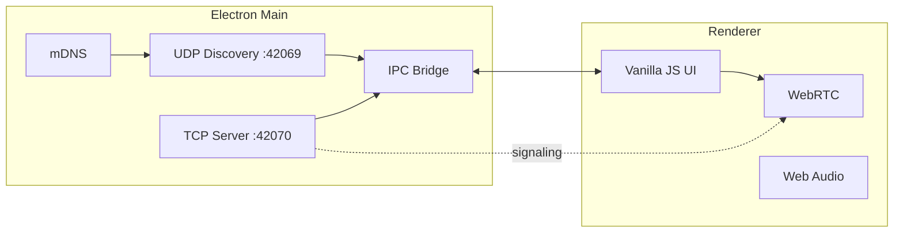

<div align="center">

# BLIP

**P2P-мессенджер для локальных сетей — без облака, без серверов, без интернета.**

[](https://www.electronjs.org/)
[](https://vitejs.dev/)
[](LICENSE)
[]()
[]()
[]()

*You're on the grid. You're the signal.* · *Ты в сети. Ты сигнал.*

</div>

---

</div>

## Обзор

| | |
|---|---|
| **Что это** | Desktop-приложение: текст, голос и видео по LAN / Hamachi / Radmin VPN |
| **Идентификация** | BLIP ID **1–64** (сетка 8×8, как чанк в Minecraft) |
| **Серверы** | Нет — только UDP broadcast, TCP и WebRTC между пирами |
| **Регистрация** | Нет |
| **Стиль UI** | Pixel-art × liquid glass × brutalism, **0px border-radius** |

## Возможности

| Функция | Описание |
|---------|----------|
| 🔢 **BLIP ID** | Выбор номера на сетке 8×8, конфликты через TCP ping |
| 📡 **Discovery** | UDP `42069` + mDNS fallback |
| 💬 **Чат** | TCP `42070`, JSON-сообщения |
| 📞 **Звонки** | WebRTC без STUN/TURN (только LAN) |
| 🎨 **Аватары** | 8×8 canvas, цвет от hash ID |
| 🔊 **Звук** | Web Audio API — синтез, без файлов |
| 🌐 **Языки** | English / Русский (`localStorage`) |
| 🖥️ **Окно** | Кастомный title bar, system tray |

## Архитектура



```
┌─────────────────────────────────────────────────────────┐
│  BLIP ID Grid 8×8          Peers          Chat / Call   │
│  ┌─┬─┬─┬─┬─┬─┬─┬─┐         #17 Online      ┌──────────┐ │
│  │1│2│3│…│ │ │ │64│  ──►   #42 Offline ──► │ messages │ │
│  └─┴─┴─┴─┴─┴─┴─┴─┘                         └──────────┘ │
└─────────────────────────────────────────────────────────┘
```

## Стек

| Слой | Технология |
|------|------------|
| Shell | Electron 35 |
| Bundler | Vite 6 |
| UI | Vanilla JS + CSS |
| Discovery | `dgram` + `multicast-dns` |
| Media | WebRTC (`RTCPeerConnection`) |
| Fonts | **Minecraft** (bundled woff2) |

## Быстрый старт

### Требования

| | |
|---|---|
| Node.js | **18+** |
| ОС | Windows 10/11 (сборка `.exe`) |
| Сеть | Одна LAN / VPN (Hamachi, Radmin) |

### Установка

```bash
git clone <repo-url>
cd "Blip Dev"
npm install
```

`postinstall` копирует шрифт Minecraft в `renderer/assets/fonts/`.

### Разработка (hot-reload)

```bash
npm run electron:dev
```

Vite → `http://localhost:5173` + Electron.

### Локальный запуск

```bash
npm run build
npx electron .
```

или `npm start` (сборка через `prebuild`).

### Сборка Windows

Иконка берётся из корневого `icon.svg` → `npm run build:icons` → `build/icon.ico`.

| Команда | Результат |
|---------|-----------|
| `npm run electron:build` | **`BLIP-Setup-0.1.0.exe`** — полноценный установщик (папка, ярлыки) |
| `npm run electron:build:portable` | **`BLIP-0.1.0-Portable.exe`** — один файл, без установки |
| `npm run electron:build:all` | Оба варианта сразу |
| `npm run electron:build:dir` | `dist-electron/win-unpacked/BLIP.exe` (папка для отладки) |

**Установщик (NSIS):** выбор каталога, ярлык в меню «Пуск», опция ярлыка на рабочем столе, иконка из `icon.svg`.

**Portable:** один `.exe`, можно копировать куда угодно; настройки — в `%APPDATA%`.

## Скрипты npm

| Скрипт | Назначение |
|--------|------------|
| `npm run dev` | Только Vite dev-server |
| `npm run build` | Сборка renderer → `dist/` |
| `npm start` | `prebuild` + Electron |
| `npm run electron:dev` | Vite + Electron |
| `npm run build:icons` | `icon.svg` → `build/icon.ico` + PNG |
| `npm run electron:build` | NSIS-установщик |
| `npm run electron:build:portable` | Portable `.exe` |
| `npm run electron:build:all` | Установщик + portable |
| `npm run electron:build:dir` | Распакованная папка |
| `npm run copy-fonts` | Скопировать Minecraft из npm-пакета |

## Порты и протоколы

| Порт | Протокол | Назначение |
|:----:|:--------:|------------|
| **42069** | UDP | Announce: `blipId`, `displayName`, `ip` |
| **42070** | TCP | Сообщения + WebRTC signaling |

<details>
<summary><strong>Пример UDP announce</strong></summary>

```json
{
  "type": "announce",
  "blipId": 17,
  "displayName": "Cyber",
  "ip": "192.168.1.42"
}
```

</details>

## Использование

1. Запустите **BLIP** на каждом ПК в одной сети.
2. Выберите свободный номер на сетке **8×8**.
3. Задайте имя в **НАСТРОЙКИ** · переключите **EN / RU**.
4. Наберите BLIP ID или откройте **АБОНЕНТЫ** → сообщение / звонок.

> ⚠️ Закройте порты **42069–42070** в firewall только если пиры не видны.

## Шрифты

| Шрифт | Где | Файлы |
|-------|-----|-------|
| **Minecraft** | Весь UI, кнопки, заголовки | `renderer/assets/fonts/minecraft.woff2` |
| **Minecraft** | Чат (как набрано) | тот же face |
| Fallback | monospace / DOS VGA | если woff2 недоступен |

Источник: [`typeface-minecraft`](https://github.com/bs-community/typeface-minecraft) (MIT).  
Перекопировать вручную: `npm run copy-fonts`.

## Структура проекта

```
Blip Dev/
├── main/              # Electron: discovery, TCP, tray
├── renderer/          # UI, chat, call, i18n, styles
│   └── assets/fonts/  # Minecraft woff2/ttf
├── preload.cjs        # IPC bridge
├── scripts/           # electron-dev, copy-fonts
└── dist/              # Vite build (после npm run build)
```

## Дизайн-система

| Токен | Значение |
|-------|----------|
| Background | `#0a0a0a` |
| Glass | `rgba(20,20,20,0.7)` + `blur(12px)` |
| Accent | `#00ffc8` |
| Danger | `#ff3366` |
| Muted | `#333333` |
| Borders | `2px solid` |
| Radius | **0** (везде) |

## Лицензия

Проект распространяется под **[GNU GPL v3](LICENSE)**.

Шрифт **Minecraft** — отдельно, [MIT](https://github.com/bs-community/typeface-minecraft) (см. `renderer/assets/fonts/README.md`).

---

<div align="center">

**BLIP** · local-only · peer-to-peer · 1–64

</div>
