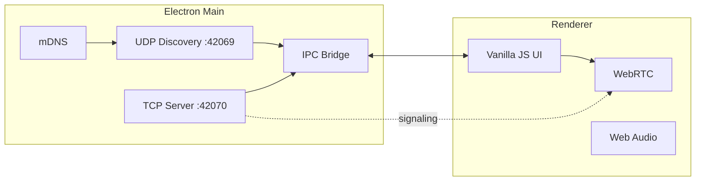

<div align="center">

# BLIP

**P2P messenger for local networks — no cloud, no servers, no internet.**

[](https://www.electronjs.org/)
[](https://vitejs.dev/)
[](LICENSE)
[]()
[]()
[]()

*You're on the grid. You're the signal.*

</div>

## Navigation

| Section | English | Русский |
|---------|---------|---------|
| Language | [**English**](#english) | [**Русский**](#russian) |
| Testing (one PC) | [Testing](#en-testing) | [Тестирование](#ru-testing) |
| Overview | [Overview](#en-overview) | [Обзор](#ru-overview) |
| Features | [Features](#en-features) | [Возможности](#ru-features) |
| Signal Corps | [Signal Corps](#en-signal-corps) | [Сигнал Корпс](#ru-signal-corps) |
| Architecture | [Architecture](#en-architecture) | [Архитектура](#ru-architecture) |
| Stack | [Stack](#en-stack) | [Стек](#ru-stack) |
| Quick start | [Quick start](#en-quick-start) | [Быстрый старт](#ru-quick-start) |
| npm scripts | [npm scripts](#en-scripts) | [Скрипты npm](#ru-scripts) |
| Ports | [Ports](#en-ports) | [Порты](#ru-ports) |
| Usage | [Usage](#en-usage) | [Использование](#ru-usage) |
| Shortcuts | [Shortcuts](#en-shortcuts) | [Горячие клавиши](#ru-shortcuts) |
| Fonts | [Fonts](#en-fonts) | [Шрифты](#ru-fonts) |
| Project layout | [Project layout](#en-layout) | [Структура](#ru-layout) |
| Design tokens | [Design](#en-design) | [Дизайн](#ru-design) |
| License | [License](#en-license) | [Лицензия](#ru-license) |
| Community | [Community](#en-community) | [Сообщество](#ru-community) |
| Landing | [krwg.github.io/BLIP](https://krwg.github.io/BLIP/) | [Сайт Pages](https://krwg.github.io/BLIP/) |

---

<h2 id="english">English</h2>

<h3 id="en-testing">Testing on one PC</h3>

| Approach | Works for chat/calls? |
|----------|---------------------|
| **Two BLIP windows on the same PC** | **No** — both try to bind UDP `42069` and TCP `42070`; the second copy usually fails or cannot discover the first. |
| **VM** (VirtualBox / Hyper-V) with bridged network | **Yes** — guest gets its own IP; install or run BLIP in the VM. |
| **Second device** on the same Wi‑Fi (laptop, old PC) | **Yes** — recommended. |
| **Hamachi / Radmin VPN** between two machines | **Yes** — same as LAN. |
| **Phone** | No mobile app yet — desktop only. |

Quick VM flow: host runs BLIP (ID **1**), VM runs BLIP (ID **2**), same subnet via bridged adapter, allow firewall for ports **42069–42070**.

<h3 id="en-overview">Overview</h3>

| | |
|---|---|
| **What** | Desktop app: text, voice, and video over LAN / Hamachi / Radmin VPN |
| **Release** | **0.7.6 — Signal Corps** (see [`CHANGELOG.md`](CHANGELOG.md)) |
| **Identity** | BLIP ID **1–64** (8×8 grid, Minecraft-style chunk metaphor) |
| **Servers** | None — UDP broadcast, TCP, and WebRTC peer-to-peer only |
| **Sign-up** | None |
| **UI** | Pixel-art × liquid glass × brutalism, **0px border-radius** |

<h3 id="en-features">Features</h3>

| Feature | Description |
|---------|-------------|
| **BLIP ID** | Pick a number on the 8×8 grid; conflicts resolved via TCP ping |
| **Discovery** | UDP `42069` + mDNS fallback |
| **Chat** | TCP messages, receipts (✓/✓✓), reactions, LAN images, linkify, emoji picker, **Ctrl+F** search, export, typing, unread |
| **Groups** | Group chat (beta), custom name & avatar, voice channels; host relay and invites |
| **Favorites** | Star peers locally; sorted first on Peers and Chat |
| **Presence** | Online / Away / Busy in Profile (UDP announce) |
| **Calls** | Separate **1:1** and **group** call windows; WebRTC voice/video (LAN, no STUN/TURN) |
| **Screen share** | 720p+ capture, theater layout, fullscreen (**F**), stream/fullscreen quality in Settings |
| **Mesh Pulse** | Live LAN heartbeat — auto ping every minute, latency under each peer |
| **Trust & block** | First-chat confirm; local block list; **Settings → Privacy** |
| **Avatars** | 8×8 auto-generated from BLIP ID; regenerate in Settings |
| **Themes** | Light/dark palettes + animated backgrounds (EN/RU names) |
| **Sound** | Chiptune Web Audio — **SIGNAL** / **PULSE** FX packs, **MESH** / **GRID** call melodies; preview in **Settings → Sound**; DND mutes all |
| **Files** | P2P send in chat (1–100 GB limit in Settings, chunked); drag & drop; group inline ≤768 KB + chunked to all members |
| **Clipboard** | Optional LAN clipboard sync — **Settings → Network** (off / active chat / trusted peers) |
| **Status** | Custom status line on LAN (Profile) — “In game”, AFK, etc. |
| **Handshake** | Ed25519 signed announce + TCP mesh handshake (0.5+); block list enforced in main |
| **Shortcuts** | In-window + system-wide (**Alt+1–4**, tray-safe) |
| **Languages** | Full **English / Russian** UI (including group call chrome and badges) |
| **Settings** | Profile, privacy/block list, appearance, network, shortcuts, call devices, transfers |
| **Window** | Custom title bar, system tray, close-to-tray (Windows), **launch at login** (Windows) |
| **Updates** | Auto-check on startup (packaged builds) |

<h3 id="en-signal-corps">Signal Corps — the must-have mesh workspace</h3>

**Signal Corps** is BLIP’s flagship feature for anyone who builds on the LAN: a dedicated **PROJECTS** section (enable in **Settings → Developer**) that is **not tied to groups** — groups stay experimental; Signal Corps is the stable war room.

| Why it matters | What you get |
|----------------|--------------|
| **Pair programming without the cloud** | Shared **Pad** — one notepad synced over TCP to every **online peer** on your mesh (LWW, 300 ms debounce). |
| **Built for dev crews** | Left rail of tools (pixel symbols, no emoji clutter): **✦ Pad** live today; **▦ Board**, **◻ Canvas**, **⧉ Clipboard** on the roadmap. |
| **LAN-native** | Same philosophy as BLIP chat and calls — no servers, no accounts, no upload to someone else’s SaaS. |
| **Off until you opt in** | Hidden by default so casual users stay on dial / chat; flip one toggle and **PROJECTS** appears in the nav — teams that try it tend to keep it open. |

If you ship one BLIP feature to your squad this quarter, make it **Signal Corps**.

<h3 id="en-architecture">Architecture</h3>



```
┌─────────────────────────────────────────────────────────┐
│  BLIP ID Grid 8×8          Peers          Chat / Call   │
│  ┌─┬─┬─┬─┬─┬─┬─┬─┐         #17 Online      ┌──────────┐ │
│  │1│2│3│…│ │ │ │64│  ──►   #42 Offline ──► │ messages │ │
│  └─┴─┴─┴─┴─┴─┴─┴─┘                         └──────────┘ │
└─────────────────────────────────────────────────────────┘
```

<h3 id="en-stack">Stack</h3>

| Layer | Technology |
|-------|------------|
| Shell | Electron 35 |
| Bundler | Vite 6 |
| UI | Vanilla JS + CSS |
| Discovery | `dgram` + `multicast-dns` |
| Media | WebRTC (`RTCPeerConnection`) |
| Fonts | **Minecraft** (bundled woff2) |

<h3 id="en-quick-start">Quick start</h3>

**Requirements**

| | |
|---|---|
| Node.js | **20+** (see `.nvmrc`) |
| OS | Windows 10/11 (for `.exe` builds) |
| Network | Same LAN / VPN (Hamachi, Radmin) |

**Install**

```bash
git clone <repo-url>
cd blip
npm install
```

`postinstall` copies the Minecraft font into `renderer/assets/fonts/`.

**Development (hot-reload)**

```bash
npm run electron:dev
```

Vite at `http://localhost:5173` + Electron.

**Run locally**

```bash
npm run build
npx electron .
```

Or `npm start` (runs `prebuild` automatically).

**Windows builds**

Icons: root `icon.svg` → `npm run build:icons` → `build/icon.ico`.

| Command | Output |
|---------|--------|
| `npm run electron:build` | **`BLIP-Setup-0.6.0.exe`** — full NSIS installer (version from `app-metadata.json`) |
| `npm run electron:build:portable` | **`BLIP-0.6.0-Portable.exe`** — single-file portable |
| `npm run electron:build:all` | Both artifacts |
| `npm run electron:build:dir` | `dist-electron/win-unpacked/BLIP.exe` (debug folder) |

- **Installer (NSIS):** choose install folder, Start Menu shortcut, optional desktop shortcut, icon from `icon.svg`.
- **Portable:** one `.exe`, copy anywhere; settings live in `%APPDATA%`.

<h3 id="en-scripts">npm scripts</h3>

| Script | Purpose |
|--------|---------|
| `npm run dev` | Vite dev server only |
| `npm run build` | Build renderer → `dist/` |
| `npm start` | `prebuild` + Electron |
| `npm run electron:dev` | Vite + Electron |
| `npm run build:icons` | `icon.svg` → `build/icon.ico` + PNG |
| `npm run electron:build` | NSIS installer |
| `npm run electron:build:portable` | Portable `.exe` |
| `npm run electron:build:all` | Installer + portable |
| `npm run electron:build:dir` | Unpacked app folder |
| `npm run copy-fonts` | Copy Minecraft font from npm package |

<h3 id="en-ports">Ports & protocols</h3>

| Port | Protocol | Purpose |
|:----:|:--------:|---------|
| **42069** | UDP | Announce: `blipId`, `displayName`, `ip` |
| **42070** | TCP | Messages + WebRTC signaling |

<details>
<summary><strong>UDP announce example</strong></summary>

```json
{
  "type": "announce",
  "blipId": 17,
  "displayName": "Cyber",
  "ip": "192.168.1.42"
}
```

</details>

<h3 id="en-usage">Usage</h3>

1. Launch **BLIP** on each machine on the same network (or VPN such as Hamachi / Radmin).
2. Pick a free number on the **8×8** grid.
3. Open **SETTINGS**: display name, **EN / RU**, themes, notifications, audio devices.
4. **DIAL** — enter a BLIP ID (centered); **MESSAGE** opens chat, **CALL** starts a voice call.
5. **PEERS** — online list with **Mesh Pulse** latency (auto refresh every minute); click to chat; right-click for Mesh label, ping, block.
6. **CHAT** — typing indicator when the peer composes; unread badge on the nav until you open the thread; **Ctrl+F** search in the open thread; hub shows **GRP** / **VOICE** for groups.
7. **Groups** — create from chat hub; **GRP CALL** starts voice; ongoing calls show a join bar; group voice runs in a **separate window** titled **Group call**.
8. **Calls (1:1)** — separate window: **M** mute, **D** deafen, **S** screen share, **F** fullscreen, **Esc** hang up.
9. **Profile** — upload an avatar; peers on the LAN receive it automatically. **Settings → System** — optional **Start BLIP when Windows starts**.

> Open firewall ports **42069–42070** only if peers are not discovered.

<h3 id="en-shortcuts">Keyboard shortcuts</h3>

| Scope | Keys | Action |
|-------|------|--------|
| Main (in window) | **Alt+1–4** | Dial / Peers / Chat / Settings |
| Main | **Ctrl+,** | Settings |
| Main | **Ctrl+F** | Focus chat search (open conversation) |
| Main (system, optional) | Same as above + **Ctrl+Shift+D** (DND), **Ctrl+Shift+End** (hang up) | Works from tray — toggle in **Settings → Shortcuts** |
| Call window | **M** / **D** / **S** / **F** | Mute / deafen / screen share / fullscreen |
| Call window (1:1 or group) | **Enter** | Accept incoming call (1:1) / group invite |
| Call window | **Esc** | End / leave call |
| Group call window | Title bar **— □ ×** | Minimize / maximize / close (close leaves the call) |

<h3 id="en-fonts">Fonts</h3>

| Font | Used for | Files |
|------|----------|-------|
| **Minecraft** | UI, buttons, headings | `renderer/assets/fonts/minecraft.woff2` |
| **Minecraft** | Chat (as typed) | same face |
| Fallback | monospace / DOS VGA | if woff2 is missing |

Source: [`typeface-minecraft`](https://github.com/bs-community/typeface-minecraft) (MIT).  
Re-copy manually: `npm run copy-fonts`.

<h3 id="en-layout">Project layout</h3>

```
blip/
├── main/              # Electron: discovery, TCP, tray, window routing
├── renderer/          # UI, chat, call, group-call, i18n, styles
│   ├── call-window.html / group-call-window.html  # separate BrowserWindows
│   ├── group-call-roster.js · group-call-client.js
│   └── assets/fonts/  # Minecraft woff2/ttf
├── docs/              # ARCHITECTURE.md + GitHub Pages landing
├── build/             # icon.ico, icon.png (generated)
├── app-metadata.json  # version 0.6.1, codename Portrait
├── preload.cjs        # IPC bridge
├── scripts/           # electron-dev, copy-fonts, build-icons, sync metadata
├── icon.svg           # source app icon
└── dist/              # Vite output (after npm run build)
```

<h3 id="en-design">Design tokens</h3>

| Token | Value |
|-------|-------|
| Background | `#0a0a0a` |
| Glass | `rgba(20,20,20,0.7)` + `blur(12px)` |
| Accent | `#00ffc8` |
| Danger | `#ff3366` |
| Muted | `#333333` |
| Borders | `2px solid` |
| Radius | **0** everywhere |

<h3 id="en-community">Community</h3>

| Doc | Purpose |
|-----|---------|
| [CONTRIBUTING.md](CONTRIBUTING.md) | Setup, dev workflow, PR expectations |
| [CODE_OF_CONDUCT.md](CODE_OF_CONDUCT.md) | Community standards |
| [SECURITY.md](SECURITY.md) | Reporting vulnerabilities |
| [CHANGELOG.md](CHANGELOG.md) | Release history |
| [docs/ARCHITECTURE.md](docs/ARCHITECTURE.md) | Technical map |
| [Landing site (Pages)](https://krwg.github.io/BLIP/) | Static showcase (`docs/index.html`) |

<h3 id="en-license">License</h3>

This project is licensed under **[GNU GPL v3](LICENSE)**.

The **Minecraft** font is licensed separately under [MIT](https://github.com/bs-community/typeface-minecraft) (see `renderer/assets/fonts/README.md`).

---

<h2 id="russian">Русский</h2>

*Ты в сети. Ты сигнал.*

<h3 id="ru-testing">Тестирование на одном ПК</h3>

| Способ | Чат / звонки? |
|--------|----------------|
| **Два окна BLIP на одном ПК** | **Нет** — порты `42069` (UDP) и `42070` (TCP) заняты; второй экземпляр не поднимется или не увидит первого. |
| **Виртуальная машина** (VirtualBox / Hyper-V, сеть bridged) | **Да** — у гостя свой IP; BLIP в VM + на хосте. |
| **Второе устройство** в той же Wi‑Fi | **Да** — лучший вариант. |
| **Hamachi / Radmin VPN** на двух машинах | **Да** — как LAN. |
| **Телефон** | Мобильного клиента пока нет. |

Кратко: хост BLIP ID **1**, в VM BLIP ID **2**, одна подсеть, firewall открыт для **42069–42070**.

<h3 id="ru-overview">Обзор</h3>

| | |
|---|---|
| **Что это** | Desktop-приложение: текст, голос и видео по LAN / Hamachi / Radmin VPN |
| **Релиз** | **0.7.6 — Signal Corps** (см. [`CHANGELOG.md`](CHANGELOG.md)) |
| **Идентификация** | BLIP ID **1–64** (сетка 8×8) |
| **Серверы** | Нет — только UDP broadcast, TCP и WebRTC между пирами |
| **Регистрация** | Нет |
| **Стиль UI** | Pixel-art × liquid glass × brutalism, **0px border-radius** |

<h3 id="ru-features">Возможности</h3>

| Функция | Описание |
|---------|----------|
| **BLIP ID** | Выбор номера на сетке 8×8, конфликты через TCP ping |
| **Discovery** | UDP `42069` + mDNS fallback |
| **Чат** | TCP: доставка/прочтение (✓/✓✓), реакции, фото по LAN, ссылки, эмодзи, **Ctrl+F** поиск, экспорт, «печатает…», непрочитанное |
| **Группы** | Групповой чат (бета), имя и аватар, голосовые каналы |
| **Избранное** | Звёздочка в меню абонента; сортировка вверху на Peers и в Chat |
| **Статус** | В сети / Отошёл / Занят в профиле (UDP announce) |
| **Звонки** | Отдельные окна **1:1** и **группового** звонка; WebRTC (LAN, без STUN/TURN) |
| **Демонстрация экрана** | Захват 720p+, theater, полный экран (**F**), качество потока/экрана в настройках |
| **Mesh Pulse** | Живой пульс LAN: автопинг раз в минуту, задержка под каждым абонентом |
| **Доверие и блок** | Подтверждение первого чата; локальный блок; **Настройки → Конфиденциальность** |
| **Аватары** | Авто-генерация 8×8 от BLIP ID; кнопка «Новый аватар» в настройках |
| **Темы** | Светлые/тёмные палитры и анимированные фоны (названия EN/RU) |
| **Звук** | Chiptune (Web Audio): наборы **СИГНАЛ** / **ПУЛЬС**, мелодии **MESH** / **СЕТКА**; прослушивание в **Настройки → Звук**; DND отключает |
| **Файлы** | P2P в чате (лимит 1–100 ГБ в настройках, чанки); drag & drop; в группе ≤768 КБ inline + чанки всем |
| **Буфер обмена** | Синхронизация по LAN — **Настройки → Сеть** (выкл / активный чат / доверенные) |
| **Статус-текст** | Своя строка в LAN (Профиль) — «в игре», AFK и т.д. |
| **Handshake** | Подписанный announce + TCP mesh-handshake (0.5+); блокировка в main |
| **Горячие клавиши** | В окне + системные (**Alt+1–4**, из трея) |
| **Языки** | Полный интерфейс **EN / RU** (включая групповой звонок и бейджи) |
| **Настройки** | Профиль, конфиденциальность/блок, вид, сеть, горячие клавиши, звонок, передачи |
| **Окно** | Свой title bar, трей, в трей (Windows), **автозапуск при входе в Windows** |
| **Обновления** | Проверка при запуске (собранные сборки) |

<h3 id="ru-signal-corps">Сигнал Корпс — главная фича для разработки в МЕШе</h3>

**Сигнал Корпс** — флагман BLIP для команд на ЛАН: отдельный раздел **ПРОЕКТЫ** (Настройки → Разработчик), **без привязки к группам**. Группы остаются бета; рабочий стол для девов — здесь.

| Зачем | Что внутри |
|-------|------------|
| **Парное кодирование без облака** | **Блокнот (Pad)** — общие заметки по TCP всем **онлайн**-абонентам (LWW, debounce 300 мс). |
| **Инструменты в стиле BLIP** | Слева каналы: **✦ Блокнот** уже работает; **▦ Доска**, **◻ Холст**, **⧉ Буфер** — в разработке. |
| **Только ЛАН** | Как чат и звонки — без серверов и чужих аккаунтов. |
| **Вкл. по желанию** | По умолчанию скрыто; один переключатель — и **ПРОЕКТЫ** в меню. Команды, которые попробуют, обычно не выключают. |

Если внедрять одну фичу BLIP в команду — начните с **Сигнал Корпс**.

<h3 id="ru-architecture">Архитектура</h3>

См. [диаграмму выше](#en-architecture) — та же схема для обоих языков.

<h3 id="ru-stack">Стек</h3>

| Слой | Технология |
|------|------------|
| Shell | Electron 35 |
| Bundler | Vite 6 |
| UI | Vanilla JS + CSS |
| Discovery | `dgram` + `multicast-dns` |
| Media | WebRTC (`RTCPeerConnection`) |
| Fonts | **Minecraft** (bundled woff2) |

<h3 id="ru-quick-start">Быстрый старт</h3>

**Требования**

| | |
|---|---|
| Node.js | **20+** (see `.nvmrc`) |
| ОС | Windows 10/11 (сборка `.exe`) |
| Сеть | Одна LAN / VPN (Hamachi, Radmin) |

**Установка**

```bash
git clone <repo-url>
cd blip
npm install
```

`postinstall` копирует шрифт Minecraft в `renderer/assets/fonts/`.

**Разработка (hot-reload)**

```bash
npm run electron:dev
```

Vite → `http://localhost:5173` + Electron.

**Локальный запуск**

```bash
npm run build
npx electron .
```

или `npm start` (сборка через `prebuild`).

**Сборка Windows**

Иконка: корневой `icon.svg` → `npm run build:icons` → `build/icon.ico`.

| Команда | Результат |
|---------|-----------|
| `npm run electron:build` | **`BLIP-Setup-0.6.0.exe`** — установщик NSIS (версия из `app-metadata.json`) |
| `npm run electron:build:portable` | **`BLIP-0.6.0-Portable.exe`** — portable |
| `npm run electron:build:all` | Оба файла |
| `npm run electron:build:dir` | `dist-electron/win-unpacked/BLIP.exe` |

- **Установщик:** выбор папки, ярлык в «Пуск», опция ярлыка на рабочем столе.
- **Portable:** один `.exe`, настройки в `%APPDATA%`.

<h3 id="ru-scripts">Скрипты npm</h3>

| Скрипт | Назначение |
|--------|------------|
| `npm run dev` | Только Vite dev-server |
| `npm run build` | Сборка renderer → `dist/` |
| `npm start` | `prebuild` + Electron |
| `npm run electron:dev` | Vite + Electron |
| `npm run build:icons` | `icon.svg` → `build/icon.ico` + PNG |
| `npm run electron:build` | NSIS-установщик |
| `npm run electron:build:portable` | Portable `.exe` |
| `npm run electron:build:all` | Установщик + portable |
| `npm run electron:build:dir` | Распакованная папка |
| `npm run copy-fonts` | Скопировать Minecraft из npm-пакета |

<h3 id="ru-ports">Порты и протоколы</h3>

| Порт | Протокол | Назначение |
|:----:|:--------:|------------|
| **42069** | UDP | Announce: `blipId`, `displayName`, `ip` |
| **42070** | TCP | Сообщения + WebRTC signaling |

<details>
<summary><strong>Пример UDP announce</strong></summary>

```json
{
  "type": "announce",
  "blipId": 17,
  "displayName": "Cyber",
  "ip": "192.168.1.42"
}
```

</details>

<h3 id="ru-usage">Использование</h3>

1. Запустите **BLIP** на каждом ПК в одной сети (или VPN: Hamachi / Radmin).
2. Выберите свободный номер на сетке **8×8**.
3. **НАСТРОЙКИ**: имя, **EN / RU**, темы, уведомления, устройства звука.
4. **НАБОР** — введите BLIP ID (по центру); **СООБЩЕНИЕ** — чат, **ЗВОНОК** — голосовой звонок.
5. **АБОНЕНТЫ** — список в сети, **Пульс · N мс** (автораз в минуту); клик — чат; ПКМ — Mesh label, пинг, блок.
6. **ЧАТ** — «печатает…»; непрочитанное на **Чат**; **Ctrl+F** — поиск в открытом чате; в hub — **ГРП** / **ГОЛОС** у групп.
7. **Группы** — создать из hub; **ГРП ЗВОНОК** — голос; активный звонок — полоса «войти»; окно **Групповой звонок** с кнопками **— □ ×**.
8. **Звонок 1:1** — отдельное окно: **M** / **D** / **S** / **F** / **Esc**.
9. **Профиль** — аватар уходит абонентам по LAN. **Настройки → Система** — **запуск при старте Windows** (опционально).

> Откройте порты **42069–42070** в firewall, только если пиры не видны.

<h3 id="ru-shortcuts">Горячие клавиши</h3>

| Область | Клавиши | Действие |
|---------|---------|----------|
| Главное окно | **Alt+1–4** | Набор / Абоненты / Чат / Настройки |
| Главное | **Ctrl+,** | Настройки |
| Главное | **Ctrl+F** | Поиск в открытом чате |
| Системные (опц.) | То же + **Ctrl+Shift+D** (не беспокоить), **Ctrl+Shift+End** (сброс звонка) | Из трея — в **Настройки → Горячие клавиши** |
| Окно звонка | **M** / **D** / **S** / **F** | Микрофон / звук / экран / полный экран |
| Окно звонка (1:1 или группа) | **Enter** | Принять (1:1) / приглашение в группу |
| Окно звонка | **Esc** | Сброс / выход из группового |
| Групповой звонок | **— □ ×** в title bar | Свернуть / развернуть / закрыть (закрытие = выход) |

<h3 id="ru-fonts">Шрифты</h3>

| Шрифт | Где | Файлы |
|-------|-----|-------|
| **Minecraft** | Весь UI | `renderer/assets/fonts/minecraft.woff2` |
| **Minecraft** | Чат | тот же face |
| Fallback | monospace | если woff2 недоступен |

Источник: [`typeface-minecraft`](https://github.com/bs-community/typeface-minecraft) (MIT).  
Перекопировать: `npm run copy-fonts`.

<h3 id="ru-layout">Структура проекта</h3>

```
blip/
├── main/              # Electron: discovery, TCP, tray, маршрутизация окон
├── renderer/          # UI, chat, call, group-call, i18n, styles
│   ├── call-window.html / group-call-window.html
│   ├── group-call-roster.js · group-call-client.js
│   └── assets/fonts/
├── docs/              # ARCHITECTURE.md + лендинг Pages
├── app-metadata.json  # 0.6.1 Portrait
├── build/ · preload.cjs · scripts/ · icon.svg · dist/
```

<h3 id="ru-design">Дизайн-система</h3>

| Токен | Значение |
|-------|----------|
| Background | `#0a0a0a` |
| Glass | `rgba(20,20,20,0.7)` + `blur(12px)` |
| Accent | `#00ffc8` |
| Danger | `#ff3366` |
| Muted | `#333333` |
| Borders | `2px solid` |
| Radius | **0** (везде) |

<h3 id="ru-community">Сообщество</h3>

| Документ | Зачем |
|----------|--------|
| [CONTRIBUTING.md](CONTRIBUTING.md) | Сборка, dev, правила PR |
| [CODE_OF_CONDUCT.md](CODE_OF_CONDUCT.md) | Правила сообщества |
| [SECURITY.md](SECURITY.md) | Как сообщить об уязвимости |
| [CHANGELOG.md](CHANGELOG.md) | История версий |
| [docs/ARCHITECTURE.md](docs/ARCHITECTURE.md) | Архитектура кода |
| [Landing (Pages)](https://krwg.github.io/BLIP/) | Статический сайт-витрина (`docs/index.html`) |

<h3 id="ru-license">Лицензия</h3>

Проект распространяется под **[GNU GPL v3](LICENSE)**.

Шрифт **Minecraft** — отдельно, [MIT](https://github.com/bs-community/typeface-minecraft) (см. `renderer/assets/fonts/README.md`).

---

<div align="center">

**BLIP** · local-only · peer-to-peer · 1–64

[English](#english) · [Русский](#russian)

</div>
